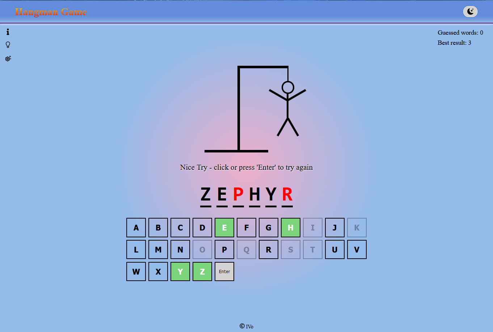

# Hangman--React-TS

"Hangman game" is a web application representing one of the popular "paper-and-pencil" games, here in an electronic version.

## Tech Stack

   

## Demo

View a demo of this app [here](https://hangman-g-a-m-e.github.io). 👀

## 🚀 About "Hangman game" web app

The app is built with React, and it follows the React development concepts. It also uses TypeScript for better development and SCSS for styles and has a responsive design.

The application consists of a public part (accessible without authentication). It has only one page with a header, info section on the left and right side under the header, and of course, the game with a drawing image, a place for the word to guess, and a keyboard.

## ⚡ Features

- light / dark mode toggle (on the right side of the header) - the selected theme is persisted in localStorage for a better experience when the user opens the app next time.

- info icons (top left side under the logo) - three icons with hidden articles that appear by hover mouse effect (for large screens) or by click.

    - text article with "Hangman game" instructions, "What do you learn from playing Hangman?" and a short history of the game.

    - another text article with "Hangman" tips & strategies and some curious facts.

    - article with filters where the player can fix the length of the word, its first letter, or select the top 3000 words in English and choose one or more of these filters. Each of these filters persists in localStorage again for a better experience for the user.

- scores section (on the top right side under the theme button) - here the user can see two scores: current guessed words in a row and the player's best result in a row. Again, this is persisted in localStorage for a better UX.

- The game 

  - by default, the app gets a random word by making a request to 'random-word-api.vercel.app', except when the user chooses the option for 'top words'. In this case, the random word comes from an Array with the top 3000 English words.
  - the player can guess a letter by clicking on the screen or typing it on his physical keyboard.
  - if he guesses a letter that occurs in the word, it appears in all its correct positions.
  - if the suggested letter does not occur in the word, on the screen adds one element of a hanged stick figure as a tally mark.
  - every button that already be used is colored in a different way and disabled.
  - if the player doesn't guess the word, it appears on the screen but the missing letters are colored in red.
  - click or type 'Enter' to refresh the word.

- modal with a message - appears when it doesn't have a word that matches the filters chosen by the player.

## Screenshot



## Run Locally

Clone the project

```bash
  git clone https://github.com/Ivaylo-St-Ivanov/Hangman--React-TS.git
```

Install dependencies

```bash
  npm i
```

Start the application with

```bash
  npm start
```

## Author

- [@IVo](https://github.com/Ivaylo-St-Ivanov) 👋

## 🔗 Links

[](https://www.linkedin.com/in/ivaylo-st-ivanov)

## Feedback

If you have any feedback, please reach out to me at ivailo.st.ivanov@gmail.com

## License

[](https://choosealicense.com/licenses/mit/)
